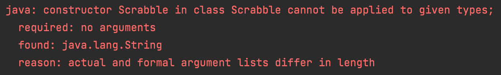

# Scrabble Challenge - this time in Java!

Welcome to the Scrabble challenge!

## Learning Objectives
- Build a simple program using functions, loops, and flow control
- Use `git` & GitHub to commit work and open a Pull Request

## Instructions

1. Fork this repository and then:
```sh
$ git clone git@github.com:digital-futures-academy/scrabble-challenge.git && cd scrabble-challenge
```
2. Run the tests from IntelliJ. There should be a lot of failures to begin with. You can run your test suite in a few ways:
   1. Right-click on the project and then select `Run all Tests`
   2. Right-click on the `ScrabbleTest` and click `Run ScrabbleTest`
   3. Open the class file `ScrabbleTest` and click the "Play" button to the left of the class declaration

Your first error when running the tests should be this:



3. In GitHub, [open a Pull Request](https://docs.github.com/en/github/collaborating-with-issues-and-pull-requests/creating-a-pull-request) from your forked repository to the challenge repository.
4. Implement the criteria below locally and [push your code](https://docs.github.com/en/github/managing-files-in-a-repository/adding-a-file-to-a-repository-using-the-command-line) to your repository! Every push to a branch that has an open Pull Request will update it automatically with your changes.

# Task

Given a word, compute the scrabble score for that word.

##### Letter Values

You'll need these:

| Letter                        | Value  |
| ----                          |  ----  |
| A, E, I, O, U, L, N, R, S, T  |     1  |
| D, G                          |     2  |
| B, C, M, P                    |     3  |
| F, H, V, W, Y                 |     4  |
| K                             |     5  |
| J, X                          |     8  |
| Q, Z                          |     10 |

Example
"cabbage" should be scored as worth 14 points:

- 3 points for C
- 1 point for A, twice
- 3 points for B, twice
- 2 points for G
- 1 point for E

And to total:

```
3 + 2x1 + 2x3 + 2 + 1
= 3 + 2 + 6 + 3
= 14
```

## Acceptance Criteria

```java

class ScrabbleRunner {

   public static void main(String[] args) {
      Scrabble scrabble = new Scrabble("");
      scrabble.score();   // => 0

      Scrabble scrabble = new Scrabble(null);
      scrabble.score();   // => 0

      Scrabble scrabble = new Scrabble("a");
      scrabble.score(); // => 1

      Scrabble scrabble = new Scrabble("f");
      scrabble.score(); // => 4

      Scrabble scrabble = new Scrabble("street");
      scrabble.score(); // =>, 6

      Scrabble scrabble = new Scrabble("quirky");
      scrabble.score(); // => 22

      Scrabble scrabble = new Scrabble("OXYPHENBUTAZONE");
      scrabble.score(); // => 41
   }
}
```

## Extended Acceptance Criteria
> Each `Scrabble` method should be no more than 5 lines and contain no more than 5 operations.

> You can play a double or a triple letter.

> You can play a double or a triple word.